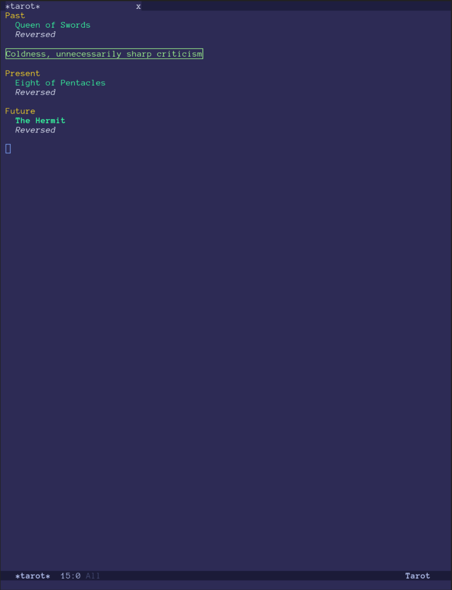

#+TITLE: tarot-emacs
#+OPTIONS: toc:nil num:nil

Draw and read tarot spreads without leaving Emacs.

tarot-emacs shuffles a standard 78-card deck and lays out readings
("spreads") in a dedicated buffer, with random upright/reversed
orientation and a meaning shown for the focused card.

Two spreads are provided: A three card "Past/Present/Future" spread and a
traditional "Celtic Cross" spread ship by default; the set of spreads is
fully customisable.

The card meanings in =tarot-meanings.el= are deliberately written at
the level of themes and energies rather than concrete fortune-telling
specifics.

* Installation

Not yet on MELPA. Install from source, e.g. with =use-package= and
=straight.el=:

#+begin_src emacs-lisp
  (use-package tarot
    :straight (tarot :type git :host github :repo "RobotDisco/tarot-emacs")
    :commands tarot-reading)
#+end_src

Or clone it and add it to your load path directly:

#+begin_src sh
git clone https://github.com/RobotDisco/tarot-emacs ~/.emacs.d/site-lisp/tarot-emacs
#+end_src

#+begin_src emacs-lisp
  (use-package tarot
    :load-path "~/.emacs.d/site-lisp/tarot-emacs"
    :commands tarot-reading)
#+end_src

Requires Emacs 26.1 or newer.

* Usage

Run =M-x tarot-reading= and select a spread. A =*Tarot*= buffer opens
showing each position in the spread, the card drawn for it, and its
orientation. The focused card's meaning is shown beneath it.

Within the =*Tarot*= buffer:

| Key | Action                          |
|-----+---------------------------------|
| n   | Move focus to the next card     |
| p   | Move focus to the previous card |
| q   | Quit the reading                |

** Customisation

- =tarot-spreads= :: alist of spread name to a list of position
  labels. Add your own spreads here.
- =tarot-show-reversed-orientation= :: when nil, cards are always
  displayed upright even if drawn reversed.

Faces such as =tarot-major-arcana-face= and =tarot-meaning-face= can
be customised via =M-x customize-group RET tarot RET=.

* Contributing

Issues and pull requests are welcome
(https://github.com/RobotDisco/tarot-emacs). Before submitting a
change:

#+begin_src sh
just test-all
#+end_src

This byte-compiles the package and runs the ERT test suite
(=tarot-test.el=) across the supported Emacs version matrix (26.1
through the current snapshot). Byte-compilation must be warning-free.

* License

GPL-3.0-or-later. See [[file:LICENSE][LICENSE]] for the full text.
